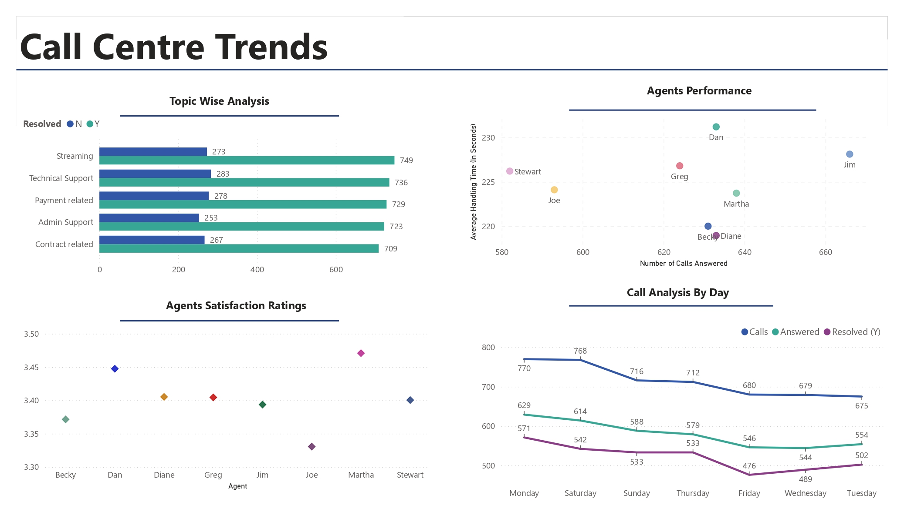
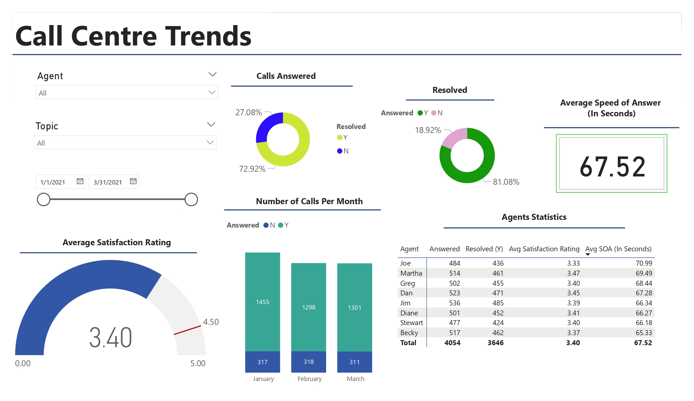
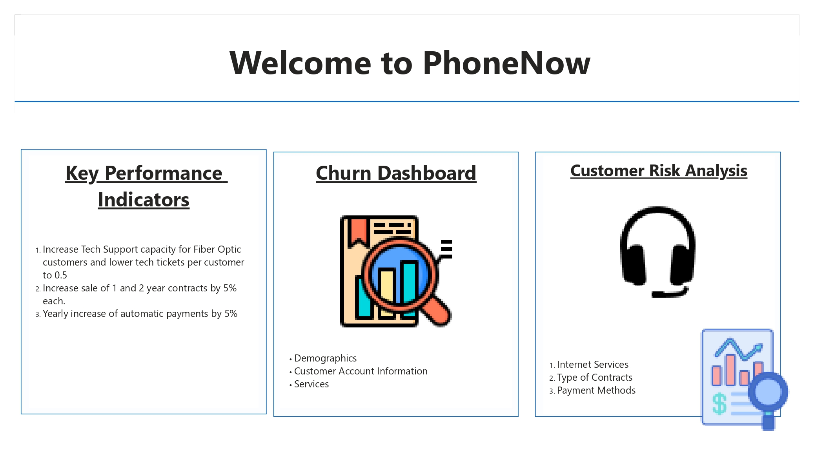
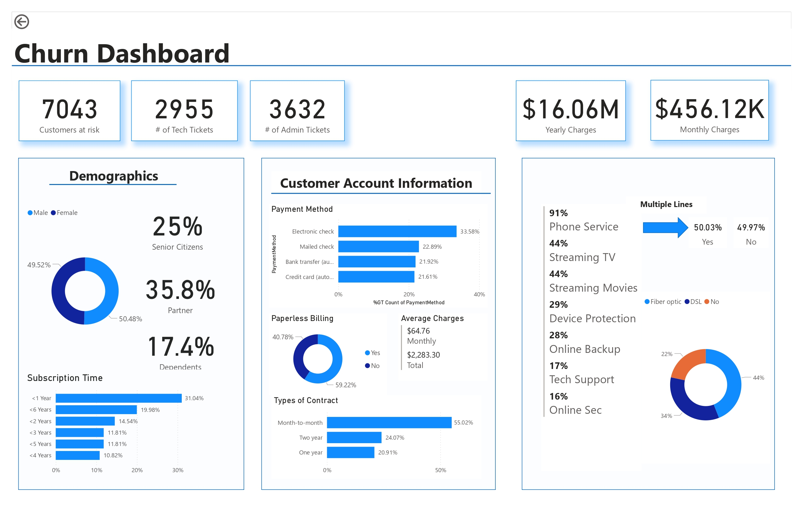
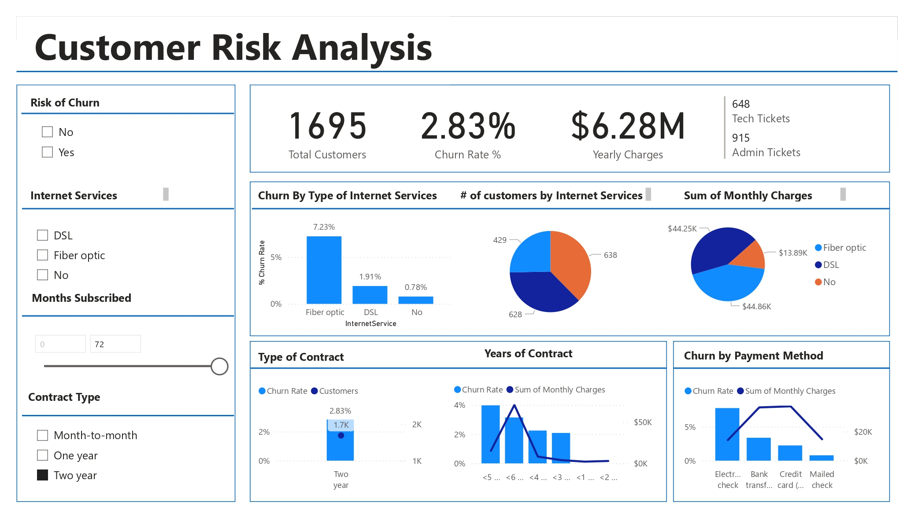
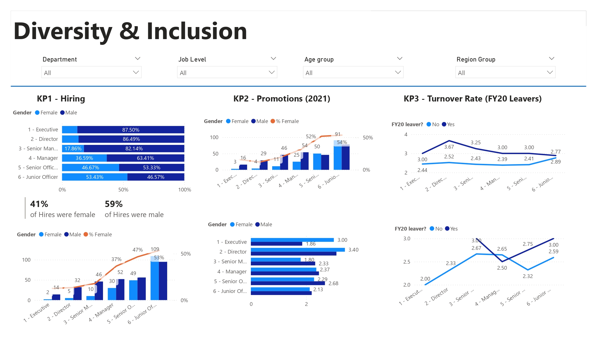
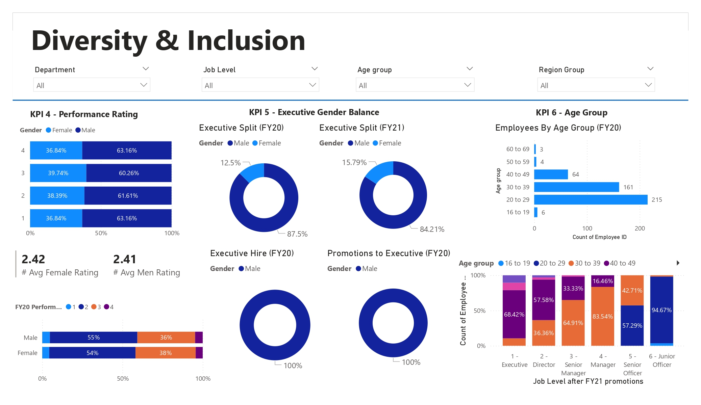
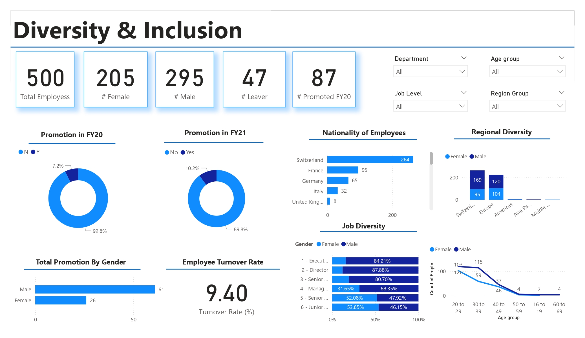

# Power BI Project: PwC Switzerland Job Simulation

## Executive Summary:
This project is part of the [Power BI Job Simulation](https://www.theforage.com/simulations/pwc-ch/power-bi-cqxg) provided by PwC Switzerland on the Forage platform. The simulation involved analyzing datasets and creating insightful dashboards to address various business problems. The primary objective was to visualize relevant KPIs and metrics across different domains such as call centre trends, customer demographics, and HR data, specifically focusing on gender balance in executive management.

## Business Problem:
1. **Call Centre Trends**: The goal was to create a dashboard to visualize key performance indicators (KPIs) and metrics from a call centre dataset. This would help in understanding the operational efficiency and performance of the call centre.
2. **Customer Demographics**: The task involved creating a dashboard to analyze customer demographics and provide insights for a telecom company, Phone Now. This would assist in understanding customer distribution and behavior.
3. **HR Data Analysis**: The objective was to create visualizations representing HR data with a focus on gender-related KPIs. The analysis aimed to identify potential root causes for the slow progress in achieving gender balance at the executive management level.

## Methodology:
1. **Data Extraction, Transformation, and Loading (ETL)**: The datasets were imported into Power BI, and necessary transformations were applied to clean and structure the data for analysis.
2. **DAX Measures**: New measures were created using Data Analysis Expressions (DAX) to compute various KPIs and metrics essential for the analysis.
3. **Dashboard Creation**: Three separate dashboards were created for each task, incorporating various visualizations to present the data effectively and provide actionable insights.

## Results & Business Recommendation:
1. **Call Centre Trends Dashboard**: The dashboard provided a comprehensive view of call centre performance, including metrics such as average call duration, customer satisfaction scores, and agent performance. The insights can be used to improve operational efficiency and enhance customer service quality.
   
   

2. **Customer Demographics Dashboard**: This dashboard visualized customer demographics and provided insights into customer segments, helping the telecom company to tailor marketing strategies and improve customer retention.
   
   
   

3. **HR Data Analysis Dashboard**: The dashboard highlighted gender-related KPIs and identified potential root causes for the gender imbalance at the executive level. Recommendations included implementing targeted diversity initiatives and monitoring progress regularly to achieve gender balance.
   
   
   

## Skills/Tools Used:
- **Power BI**: For creating interactive dashboards and visualizations.
- **DAX (Data Analysis Expressions)**: To create new measures and perform complex calculations.
- **ETL (Extract, Transform, Load)**: For data cleaning and preparation.
- **Forage Platform**: Source of the project and datasets.

---
This project showcases the application of Power BI in solving real-world business problems by creating data-driven insights through effective visualizations.
